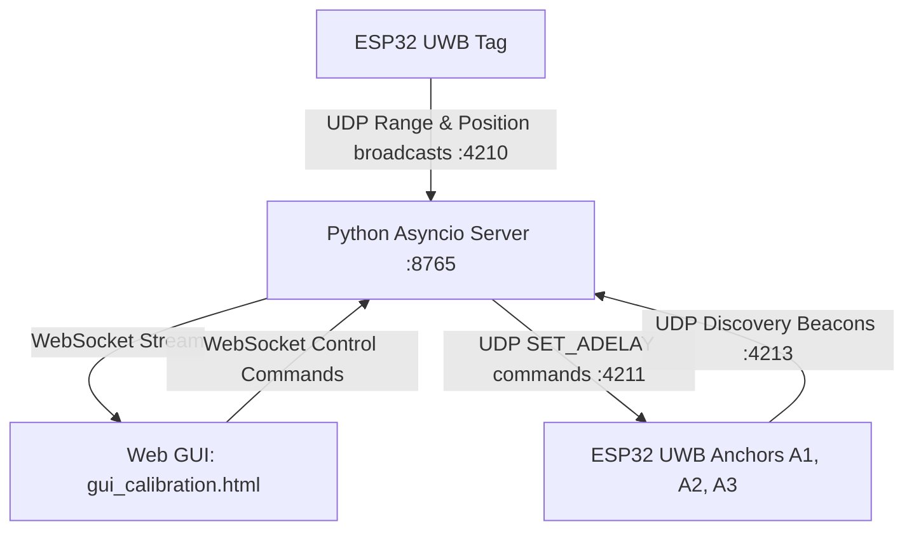

# UWB Auto-Calibration System (`2x2mtest2_calibration`)

An automated calibration and optimization package for a 3-anchor Ultra-Wideband (UWB) localization system. This package calculates antenna delay corrections and refines anchor coordinates to achieve sub-centimeter ranging precision and highly stable 2D positioning.

---

## 1. System Architecture

The auto-calibration system operates as a closed-loop network comprising hardware nodes, a central asynchronous server, and an interactive web GUI:



1. **UWB Anchors (A1, A2, A3)**: Standard decaWave DW1000 ranging responders. On startup, they load their antenna delay configuration from Non-Volatile Storage (NVS via ESP32 `Preferences`) and begin broadcasting discovery beacons. Once acknowledged by the server, they enter responder mode and listen on UDP command port `4211` for dynamic antenna delay updates.
2. **UWB Tag**: Ranging initiator. It continuously ranges to the three anchors, filters the range data (Median + EMA + EKF), performs local 2D trilateration, and broadcasts JSON packets containing raw ranges, trilaterated positions, filtered positions, and timestamps via UDP on port `4210`.
3. **Python Server (`calibration_server.py`)**: The central routing hub. It discovers anchors, logs ground-truth calibration data, runs the optimization pipeline (`calibration_optimizer.py`), and coordinates network commands.
4. **Web GUI (`gui_calibration.html`)**: The user interface. It renders a live coordinate grid, visualizes positioning error vectors, guides the user through grid-point calibration capture, and provides controls to execute and apply optimizations.

---

## 2. Mathematical Formulation

Ranging inaccuracies in UWB systems are primarily driven by **antenna delays**—the physical time offset between the chip's internal digital timestamp transmitter/receiver triggers and the actual propagation of RF signals from/to the antenna.

### 2.1 The Antenna Delay Model
Let $d_{\text{true}}$ be the geometric Euclidean distance between a tag and anchor $i$. The measured range $d_{i, \text{meas}}$ is contaminated by a positive bias proportional to the antenna delay error:
$$d_{i, \text{meas}} \approx d_{\text{true}} + \text{bias}_i$$

The DW1000 internal clock operates at a reference frequency derived from the transceiver:
$$T_{\text{ref}} = \frac{1}{499.2 \text{ MHz} \times 128} = \frac{1}{63.8976 \text{ GHz}} \approx 15.65 \text{ picoseconds}$$

Given the speed of light $c \approx 299,792,458 \text{ m/s}$, the spatial propagation distance corresponding to one unit of antenna delay register is:
$$d_{\text{unit}} = c \times T_{\text{ref}} \approx 4.6917 \text{ mm}$$

Because of the internal conversions, timing scales, and Two-Way Ranging (TWR) arithmetic, adjusting the antenna delay register by $\delta_i$ units modifies the measured distance by:
$$d_{i, \text{corr}} = d_{i, \text{meas}} - \delta_i \cdot \gamma$$
Where $\gamma = 0.4691 \text{ mm} = 0.4691 \times 10^{-3} \text{ m}$ is the spatial scaling constant.

### 2.2 Closed-Form Linear Trilateration
To estimate the tag's position $\vec{p} = (x, y)^T$ from the corrected distances $d_1, d_2, d_3$ to the three anchors located at $\vec{a}_i = (x_i, y_i)^T$, we expand the circle equations:
$$(x - x_i)^2 + (y - y_i)^2 = d_i^2 \implies x^2 + y^2 - 2x x_i - 2y y_i + k_i = d_i^2$$
Where $k_i = x_i^2 + y_i^2$ is the squared norm of the anchor coordinates. 

Subtracting the equation of anchor 1 ($i=1$) from the equations of anchor 2 and 3 eliminates the non-linear quadratic term $x^2 + y^2$, yielding a linear system:
$$2x(x_2 - x_1) + 2y(y_2 - y_1) = d_1^2 - d_2^2 + k_2 - k_1$$
$$2x(x_3 - x_1) + 2y(y_3 - y_1) = d_1^2 - d_3^2 + k_3 - k_1$$

In matrix form:
$$\mathbf{A} \vec{p} = \frac{1}{2} \mathbf{b}$$
Where:
$$\mathbf{A} = \begin{bmatrix} x_2 - x_1 & y_2 - y_1 \\ x_3 - x_1 & y_3 - y_1 \end{bmatrix}, \quad \mathbf{b} = \begin{bmatrix} d_1^2 - d_2^2 + k_2 - k_1 \\ d_1^2 - d_3^2 + k_3 - k_1 \end{bmatrix}$$

The estimated position is resolved in closed-form as:
$$\vec{p} = \frac{1}{2} \mathbf{A}^{-1} \mathbf{b}$$
Because the anchor coordinates are fixed, the matrix $\mathbf{A}^{-1}$ is precomputed once, making this estimator extremely fast and differentiable.

### 2.3 Calibration Optimization Formulation
Let $M$ be the number of calibration grid points (typically 9). For each calibration point $j \in \{1, \dots, M\}$, we place the tag at a known physical ground-truth position $\vec{p}_{\text{true}, j} = (x_{\text{true}, j}, y_{\text{true}, j})^T$. We accumulate $N$ samples to compute the mean measured ranges to each anchor: $\bar{d}_{1, j}, \bar{d}_{2, j}, \bar{d}_{3, j}$.

Given a trial correction vector of antenna delays $\vec{\delta} = (\delta_1, \delta_2, \delta_3)^T$, the corrected range inputs are:
$$d_{i, j, \text{corr}}(\vec{\delta}) = \bar{d}_{i, j} - \delta_i \cdot \gamma$$

The optimization objective is to minimize the sum of squared position errors (Euclidean distance residuals) over all calibration points:
$$J(\vec{\delta}) = \sum_{j=1}^{M} \| \vec{p}_{\text{est}, j}(\vec{\delta}) - \vec{p}_{\text{true}, j} \|^2 = \sum_{j=1}^{M} \left[ (x_{\text{est}, j}(\vec{\delta}) - x_{\text{true}, j})^2 + (y_{\text{est}, j}(\vec{\delta}) - y_{\text{true}, j})^2 \right]$$

This is subject to delay bounds:
$$-\Delta_{\text{bound}} \leq \delta_i \leq \Delta_{\text{bound}} \quad (\text{with } \Delta_{\text{bound}} = 500\text{ units})$$

#### Co-optimization of Anchor Positions (Optional)
If anchor placements have physical errors, we can also optimize the coordinates $\vec{a}_i = \vec{a}_{i, \text{base}} + \Delta\vec{a}_i$, where $\Delta\vec{a}_i = (\Delta x_i, \Delta y_i)^T$:
$$-\Delta_{\text{coord}} \leq \Delta x_i, \Delta y_i \leq \Delta_{\text{coord}} \quad (\text{with } \Delta_{\text{coord}} = 10\text{ cm})$$
This extends the parameter space to 9 variables (3 delays, 6 coordinate deltas), recomputing $\mathbf{A}^{-1}$ and $k_i$ at each optimization step. The optimizer utilizes SciPy’s bounded Trust Region Reflective (`trf`) non-linear least-squares solver.

---

## 3. Directory and File Breakdown

```
2x2mtest2_calibration/
├── Code/
│   ├── Tag/
│   │   └── esp32code_trilateration_calib.ino   # Tag firmware
│   ├── anchor/
│   │   ├── anchor1_top_calib.ino               # Anchor 1 responder firmware
│   │   ├── anchor2_bottom_left_calib.ino       # Anchor 2 responder firmware
│   │   └── anchor3_bottom_right_calib.ino      # Anchor 3 responder firmware
│   ├── config.py                               # Global ports, SSID, geometry config
│   ├── calibration_optimizer.py                # SciPy optimization engine
│   ├── calibration_server.py                   # Asyncio WebSocket/UDP server
│   └── gui_calibration.html                    # Dashboard, grid control, map visualization
├── Data/                                       # Saved calibration logs (.json)
└── Documentation/
    └── calibration_manual.tex                  # Premium LaTeX manual draft
```

### 3.1 `Code/config.py`
Defines the constants shared between Python scripts and compiled firmware:
* **Network Ports**:
  * `TAG_UDP_PORT = 4210`: UDP socket where the tag broadcasts JSON packets.
  * `ANCHOR_CMD_PORT = 4211`: UDP socket on anchors for receiving command frames.
  * `BEACON_PORT = 4213`: UDP socket where anchors broadcast discovery beacons.
  * `WS_PORT = 8765`: WebSocket port for GUI connection.
* **WiFi SSID & Password**: Credentials loaded by the ESP32 units.
* **Anchor Geometry**: Coordinates of the three anchors. In the default configuration, they form an equilateral triangle of radius $2\text{ m}$ centered at $(0,0)$.
* **Workspace & Grid**: A $2\text{m} \times 2\text{m}$ square containing 9 evenly spaced points used as calibration targets.

### 3.2 `Code/calibration_optimizer.py`
The mathematical engine of the system.
* Pre-computes matrix $\mathbf{A}^{-1}$ and vector $\mathbf{k}$ to construct a closed-form trilateration solver.
* Houses the cost functions: `_residuals_delays_only` (3 parameters) and `_residuals_with_positions` (9 parameters).
* Calls `scipy.optimize.least_squares` to solve the bounded optimization.
* Includes a self-contained CLI smoke test. Running the file independently generates artificial ranging errors and validates that the optimizer successfully retrieves the correct calibration offsets.

### 3.3 `Code/calibration_server.py`
An asynchronous server managing concurrently running loops:
* **Discovery Protocol**: Listens for discovery beacons from anchors. When an anchor announces itself, the server logs its IP, reads its current delay, caches it in `discovered_anchors.json`, and sends a `"ACK:<ID>"` frame to silence the anchor's beacon.
* **Tag Data Protocol**: Receives UDP telemetry from the tag. It handles sample collection when capturing calibration points, computes statistic data (means and standard deviations), and relays the packets to the WebSocket.
* **WebSocket Dispatcher**: Manages connections from the Web GUI, decoding commands (`start_capture`, `optimize`, `apply`, `save_session`) and sending back JSON state structures.
* **Command Client**: Transmits UDP payloads to anchors (e.g. `"SET_ADELAY:16560"`) and awaits confirming replies.

### 3.4 `Code/gui_calibration.html`
An HTML5 single-page application split into two modes:
1. **Live Tab**: A real-time system monitor. Renders estimated tag coordinates, EKF-smoothed paths, live error margins (RMSE), and range lines. Includes features to export history to CSV.
2. **Calibrate Tab**: The calibration control deck. Displays anchor discovery states, coordinate grid points, capture progress bars, and optimization controls. After running an optimization, it plots error vectors (offsets) directly onto the grid.

### 3.5 `Code/Tag/esp32code_trilateration_calib.ino`
Firmware for the mobile tag. Features a **3-tier filtering pipeline**:
1. **Median Filter (Window=7)**: Suppresses transient multi-path spikes.
2. **EMA & Outlier Gate**: Smoothes noise using Exponential Moving Average ($\alpha = 0.25$) and rejects jumps exceeding $0.5\text{ m}$.
3. **Extended Kalman Filter (EKF)**: Models 2D motion dynamics using a constant velocity transition matrix. The measurement covariance $R$ scales dynamically with the local trilateration RMSE to dynamically throttle noisy range signals:
   $$R = R_{\text{base}} \left( 1 + 15.0 \cdot \text{RMSE}^2 \right)$$
* Adds a millisecond timestamp (`ts`) to UDP JSON packets, allowing the Python server to detect duplicate packets.

### 3.6 `Code/anchor/anchorX_calib.ino`
Responders deployed at fixed coordinates.
* Read the stored antenna delay from NVS on boot.
* Broadcast discovery beacons (`{"beacon":"anchor",...}`) every 5 seconds until a server ACK is received.
* Listen for command sockets to update (`SET_ADELAY`) or read (`GET_ADELAY`) antenna delays, writing updates to flash memory.

---

## 4. Ranging Filter Pipeline (Tag Firmware)

The ESP32 Tag uses three layers of filtering to process raw distance estimates before broadcasting:

```
                  +-----------------------------------------+
                  |           Raw UWB Range Data            |
                  +-----------------------------------------+
                                       |
                                       v
                  +-----------------------------------------+
                  |         Layer 1: Median Filter          | (Window = 7)
                  +-----------------------------------------+
                                       |
                                       v
                  +-----------------------------------------+
                  |       Layer 2: EMA + Outlier Gate       | (Gate = 0.5m, Alpha = 0.25)
                  +-----------------------------------------+
                                       |
                                       v
                  +-----------------------------------------+
                  |      Layer 3: Closed-Form Trilat        |
                  +-----------------------------------------+
                                       |
                                       v
                  +-----------------------------------------+
                  |       Layer 4: Kalman Filter (EKF)      | (Dynamic R Covariance)
                  +-----------------------------------------+
```

1. **Median Filtering**: Eliminates range spikes by selecting the middle value of 7 consecutive samples.
2. **Outlier Gate**: Compares the median result with the previous step. If the difference is $>50\text{ cm}$, the sample is treated as multi-path bounce and ignored.
3. **EMA Smoothing**: Applies $\alpha=0.25$ to suppress high-frequency jitter.
4. **Dynamic Covariance EKF**: Fuses the trilaterated position into a kinematics motion model. The process uses the trilateration residual error (RMSE) to inflate measurement covariance when UWB signals are noisy or degraded. If RMSE exceeds $80\text{ cm}$, the Kalman update is bypassed.

---

## 5. Setup and Execution Guide

Follow these steps to configure, deploy, and calibrate your UWB system.

### Step 1: Physical Setup
1. Position the three UWB anchors at their exact coordinates relative to your coordinate system center $(0,0)$:
   * **Anchor 1 (A1)**: $(0.00, 2.00)$ - Top Center
   * **Anchor 2 (A2)**: $(-1.732, -1.00)$ - Bottom Left
   * **Anchor 3 (A3)**: $(1.732, -1.00)$ - Bottom Right
2. Mount the anchors at identical heights. Mark the 9 grid calibration points inside the $2\text{m} \times 2\text{m}$ workspace ($X \in [-1, 1], Y \in [-1, 1]$) on the floor.

### Step 2: Configure SSID & Passwords
1. Open `Code/config.py` and set your local WiFi network details:
   ```python
   WIFI_SSID = "YOUR_SSID"
   WIFI_PASS = "YOUR_PASSWORD"
   ```
2. Copy these network credentials into the following firmware source files:
   * `Code/Tag/esp32code_trilateration_calib.ino` (Lines 18-19)
   * `Code/anchor/anchor1_top_calib.ino` (Lines 30-31)
   * `Code/anchor/anchor2_bottom_left_calib.ino` (Lines 30-31)
   * `Code/anchor/anchor3_bottom_right_calib.ino` (Lines 30-31)

### Step 3: Flash Firmware
1. Open the Arduino IDE or PlatformIO.
2. Install the necessary libraries:
   * **DW1000** (by Thomas Trojer)
   * **DW1000Ranging**
3. Compile and flash the respective code to each node:
   * Flash `esp32code_trilateration_calib.ino` to the tag ESP32.
   * Flash `anchor1_top_calib.ino` to Anchor 1.
   * Flash `anchor2_bottom_left_calib.ino` to Anchor 2.
   * Flash `anchor3_bottom_right_calib.ino` to Anchor 3.

### Step 4: Run the Calibration Server
1. Navigate to the code folder:
   ```bash
   cd Tests/2x2mtest2_calibration/Code
   ```
2. Install Python dependencies:
   ```bash
   pip install websockets numpy scipy
   ```
3. Run the server:
   ```bash
   python calibration_server.py
   ```
   *The server loads cached IP configurations if `discovered_anchors.json` exists, otherwise it opens listener ports.*

### Step 5: Start the Dashboard GUI
1. Open `Code/gui_calibration.html` directly in a web browser (e.g. Chrome, Firefox).
2. The UI automatically establishes a WebSocket connection to the server on `ws://localhost:8765`.
3. Power on the anchors. The terminal and the GUI's **Calibrate** sidebar will show discovery updates. Once all three anchors beacon, their statuses turn green and their IP addresses are logged.

### Step 6: Perform Calibration Data Collection
1. In the Web GUI, select the **Calibrate** tab.
2. **Move the UWB Tag** to the first grid coordinate, e.g. $(-1.0, 1.0)$.
3. Click the target point $(-1.0, 1.0)$ on the interactive screen.
4. Click **Capture**. The tag begins logging. The progress bar tracks range acquisition (typically 200 packets).
5. Once complete, the grid point turns green and shows a checkmark.
6. **Repeat** this process for all 9 points (or at least 3 points) of the grid layout.

### Step 7: Calculate and Apply Calibration
1. Check **Co-optimize anchor positions** if you suspect minor physical placement errors.
2. Click **Optimize**. The server runs the optimization routine.
3. Review the diagnostic results in the panel:
   * Review before vs. after RMSE (e.g., $15\text{ cm} \rightarrow 1.8\text{ cm}$).
   * Inspect the red error vectors drawn on the map.
4. Click **Apply**. The server pushes the optimized antenna delay values to each anchor.
5. The anchors write their parameters to NVS, commit them to active DW1000 registers, and reply to the server.
6. Switch back to the **Live** tab. Move the tag around the workspace to verify that position coordinates are accurate and noise-free.
7. Click **Save** in the calibration sidebar to save the session data to a JSON log file under the `Data/` folder.
